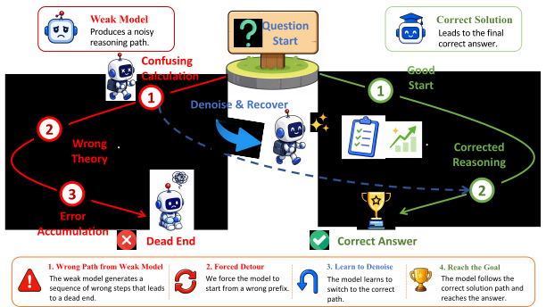

# DenoiseRL: Bootstrapping Reasoning Models to Recover from Noisy Prefixes

**Caijun Xu, Changyi Xiao, Zhongyuan Peng, Yixin Cao**

Fudan University · Shanghai Innovation Institute

<!-- [](paper/_Arxiv__TEAI_DenoiseRL__Bootstrapping_Reasoning_Models_to_Recover_from_Noisy_Prefixes__Copy_.pdf)
[](#)
[](#) -->



*Figure 1. DenoiseRL conditions the policy on a truncated incorrect prefix produced by a weak model and trains it, via verifiable-reward RL, to denoise the corrupted reasoning state and recover the correct solution path.*

---

This repository contains the **official implementation** of *DenoiseRL: Bootstrapping Reasoning Models to Recover from Noisy Prefixes*. DenoiseRL is a recovery-oriented reinforcement learning framework that **replaces stronger-teacher supervision with structured perturbations derived from weak-model failures**. Rather than imitating a stronger model or curating harder data, the policy is conditioned on incorrect reasoning prefixes and explicitly optimized to revise mistakes and reach a verified answer.

## Table of Contents

- [DenoiseRL: Bootstrapping Reasoning Models to Recover from Noisy Prefixes](#denoiserl-bootstrapping-reasoning-models-to-recover-from-noisy-prefixes)
  - [Table of Contents](#table-of-contents)
  - [1. Motivation](#1-motivation)
  - [2. Method at a Glance](#2-method-at-a-glance)
  - [3. Key Results](#3-key-results)
  - [4. Repository Layout](#4-repository-layout)
  - [5. Installation](#5-installation)
  - [6. Data Preparation](#6-data-preparation)
  - [7. Training](#7-training)
  - [8. Reproduction Guidance](#8-reproduction-guidance)
  - [9. Citation](#9-citation)

---

## 1. Motivation

State-of-the-art reasoning RL pipelines (e.g., GRPO and DAPO) are typically constrained along two axes:

1. **Supervisory ceiling.** Performance gains often hinge on access to a *stronger* teacher model, capping further progress when such teachers are unavailable.
2. **Data engineering cost.** Capability scaling commonly relies on heavy hard-data curation, adversarial synthesis, or trajectory filtering.

DenoiseRL departs from both directions. We **invert the role of weak models**: instead of treating them as imperfect supervisors, we exploit them as low-cost generators of structured corruptions. The policy is conditioned on truncated incorrect prefixes and trained — under standard verifiable rewards — to **denoise** the corrupted state and arrive at a verified solution. This casts reasoning RL as a denoising problem, drawing a conceptual parallel to denoising autoencoders and BART-style pretraining.

## 2. Method at a Glance

Each training step samples, per problem, a mixture of two rollout types and updates the policy with a single GRPO-style group baseline shared across the mixture:

- **Main rollouts** *(N per problem):* standard on-policy generations conditioned on the prompt.
- **Denoise rollouts** *(K per problem):* generations conditioned on a truncated weak-model wrong prefix. Given a wrong solution `w`, we retain its first `p = max(1, ⌊rho · |w|⌋)` tokens as an assistant-side prefix; the policy continues from this corrupted state.

Three design choices stabilize and amplify the recovery signal:

- **Length-fair folding.** The visible response is `ỹ = [w₁:p, y_{p+1:p+L}]` with `p + L ≤ R`, preserving a comparable response budget against main rollouts.
- **Continuation-only optimization.** PPO/GRPO gradients flow primarily through the model-generated continuation; the heavily off-policy prefix is verifier-visible but excluded from the loss, avoiding the high-variance importance ratios documented in prior PPO-style off-policy literature.
- **Shared group baseline.** Main and denoise trajectories of the same problem share a single advantage baseline, so denoise rollouts naturally provide negative or contrastive signal for problems that are otherwise saturated.

The joint objective can be written as a mixture
`J(θ) = N/(N+K) · J_main(θ) + K/(N+K) · J_denoise(θ)`,
which is interpretable as optimizing the policy under a mixture of *solving-from-scratch* and *recovering-from-corruption* distributions.

## 3. Key Results

Reported in the paper across Qwen3-4B and Qwen3-8B policy backbones (training corpus: MATH-7.5K; weak model: Qwen2.5-1.5B-Instruct). For AMC23, AIME24, and AIME25 we report AVG@16; for MATH500 and BBEH we report AVG@1.

**Qwen3-4B-Base**


| Method             | MATH500  | AMC23    | AIME24   | AIME25   | BBEH     | Avg.     |
| ------------------ | -------- | -------- | -------- | -------- | -------- | -------- |
| Base               | 70.0     | 43.1     | 8.3      | 7.7      | 4.1      | 26.6     |
| GRPO               | 83.6     | 63.1     | 22.1     | 18.1     | 11.1     | 39.6     |
| DAPO               | 83.8     | 62.5     | 20.6     | 21.5     | 10.4     | 39.8     |
| **DenoiseRL-GRPO** | **85.8** | 61.4     | **24.8** | **23.3** | 14.8     | **42.0** |
| DenoiseRL-DAPO     | 84.6     | **63.6** | 21.9     | 21.7     | **15.7** | 41.5     |


**Qwen3-8B-Base**


| Method             | MATH500  | AMC23    | AIME24   | AIME25   | BBEH     | Avg.     |
| ------------------ | -------- | -------- | -------- | -------- | -------- | -------- |
| Base               | 70.4     | 49.2     | 11.9     | 10.8     | 4.1      | 29.3     |
| GRPO               | 87.8     | 69.7     | 24.0     | 22.9     | 10.6     | 43.0     |
| DAPO               | 87.0     | 69.7     | 23.8     | 21.7     | 11.7     | 42.8     |
| DenoiseRL-GRPO     | 87.2     | 70.3     | 24.6     | 23.1     | 11.5     | 43.3     |
| **DenoiseRL-DAPO** | **88.2** | **71.4** | **27.0** | **24.8** | **12.6** | **44.8** |


Additional takeaways from the ablation studies:

- **Recovery intensity matters.** Sweeping `K ∈ {1, 4, 8}` at `rho = 0.2` shows `K = 4` provides the best trade-off; over-emphasized recovery (`K = 8`) hurts the primary solving objective.
- **Off-policy prefix updates are unstable.** Directly backpropagating through prefix tokens leads to validation collapse and runaway response length — consistent with prior observations on PPO sensitivity to heavily off-policy tokens.
- **Length-fair folding helps.** Removing the `p + L ≤ R` cap weakens the 4B average by ~1.8 points (42.0 → 40.2).
- **Throughput overhead is modest.** Per-step training time on Qwen3-4B-Base is 49.7s for DenoiseRL vs. 43.8s for GRPO under matched rollout budgets.

We refer readers to the paper for full ablations, the case-study analyses of recovery behavior, and the length / overthinking dynamics under varying `rho`.

## 4. Repository Layout

```
DenoiseRL/
├── recipe/denoise/                    # DenoiseRL recipe (entrypoints, trainer, configs)
│   ├── main_dapo.py                   # training entrypoint
│   ├── dapo_ray_trainer.py            # Ray-based DAPO/GRPO trainer with denoise rollouts
│   ├── data_prepare.py                # weak-model wrong-prefix construction
│   ├── config/                        # Hydra training configs
│   ├── denoise_qwen3-{1.7b,4b,8b}_v1.0.sh
│   └── dapo_denoise_qwen3-{1.7b,4b,8b}_v1.0.sh
├── verl/                              # local fork of the verl RL framework (editable install)
├── img/DenoiseRL.png                  # overview figure
├── paper/                             # paper PDF
└── requirements.txt
```

## 5. Installation

DenoiseRL builds on a customized fork of `verl`. Two steps in particular are **mandatory**: installing the pinned dependencies and registering the local `verl` package in editable mode.

```bash
# (1) Create an isolated environment and install pinned dependencies.
python -m venv .venv
source .venv/bin/activate
pip install -r requirements.txt

# (2) Critical: register the local `verl` framework in editable mode.
# This is required for the DenoiseRL recipe to import and override the
# trainer / rollout components shipped in this repository.
cd verl
pip install --no-deps -e .
cd ..
```

> **Note.** The `--no-deps` flag is intentional: dependency resolution is already pinned via `requirements.txt`, and re-resolving from `verl/setup.py` can silently override critical versions (e.g., `vllm`, `transformers`, `flash-attn`). The editable install ensures that any local modification to the framework propagates at runtime without re-installation.

Hardware-sensitive components (`flash-attn`, `vllm`, `cupy-cuda12x`, `torch_npu`, etc.) should be installed against the CUDA/driver stack of the target cluster.

## 6. Data Preparation

`recipe/denoise/data_prepare.py` constructs the per-problem pool `W(q)` of incorrect-but-well-formed weak-model rollouts. It runs the weak model with vLLM, scores each rollout against the ground truth, and augments the source parquet with a `wrong_answer_with_boxed` column storing the wrong rollouts that nevertheless emit a parseable `\boxed{...}`.

```bash
python recipe/denoise/data_prepare.py \
  --model    /path/to/weak-model \
  --dataset  /path/to/train.parquet \
  --rollout-n 8 \
  --output-dir ./data
```

The resulting `*.with_wrong_boxed.parquet` is consumed directly by `TRAIN_FILE` in the training scripts. Problems with an empty wrong-rollout pool fall back to standard main rollouts, as described in the paper.

## 7. Training

Each model scale ships with two recipes: a GRPO-style backbone and a DAPO variant.

```bash
# GRPO backbone
bash recipe/denoise/denoise_qwen3-1.7b_v1.0.sh
bash recipe/denoise/denoise_qwen3-4b_v1.0.sh
bash recipe/denoise/denoise_qwen3-8b_v1.0.sh

# DAPO variant
bash recipe/denoise/dapo_denoise_qwen3-1.7b_v1.0.sh
bash recipe/denoise/dapo_denoise_qwen3-4b_v1.0.sh
bash recipe/denoise/dapo_denoise_qwen3-8b_v1.0.sh
```

The DenoiseRL-specific knobs are exposed at the top of each script:


| Knob                                      | Symbol | Description                                                                                |
| ----------------------------------------- | ------ | ------------------------------------------------------------------------------------------ |
| `n_resp_per_prompt`                       | `N`    | number of main on-policy rollouts per problem                                              |
| `sub_rollout_k`                           | `K`    | number of denoise rollouts per problem                                                     |
| `part_response_ratio_strategy`            | —      | `fixed` / `normal` / `uniform` sampler for `rho`                                           |
| `part_response_ratio_fixed`               | `rho`  | prefix ratio under the `fixed` strategy                                                    |
| `part_response_ratio_{mean,std,low,high}` | —      | parameters for `normal` / `uniform` strategies                                             |
| `partial_mode`                            | —      | `cutdown` (mask prefix, length-fair), `shift` (gradient on prefix), `none` (no length cap) |
| `use_problem_id_as_uid`                   | —      | share a single GRPO baseline across all `N + K` rollouts of one problem                    |


Cluster / path settings — `MODEL_PATH`, `TRAIN_FILE`, `TEST_FILE`, `num_gpus`, `tensor_model_parallel_size` — are likewise configured at the top of each script.

## 8. Reproduction Guidance

To reproduce the headline numbers reported in the paper, we recommend:

- **Rollout composition:** `N = 12, K = 4` per problem.
- **Prefix intensity:** `part_response_ratio_strategy=fixed` with `part_response_ratio_fixed=0.2`.
- **Folding policy:** `partial_mode=cutdown` (length-fair; prefix masked from PPO loss).
- **Response budget:** `max_response_length` consistent across main and denoise rollouts.
- **Optimization:** continuation-only gradient flow; do not enable gradients on the off-policy prefix.
- **Group baseline:** `use_problem_id_as_uid=True` to share advantages across the full `N + K` group.

Deviating from any of the above (in particular enabling gradient on the prefix or removing the length-fair cap) is documented in the paper as a source of instability.

## 9. Citation

If you find this work useful, please consider citing:

```bibtex
@article{xu2026denoiserl,
  title   = {DenoiseRL: Bootstrapping Reasoning Models to Recover from Noisy Prefixes},
  author  = {Xu, Caijun and Xiao, Changyi and Peng, Zhongyuan and Cao, Yixin},
  journal = {arXiv preprint},
  year    = {2026}
}
```

For questions or collaboration, please contact the corresponding authors as listed in the paper.