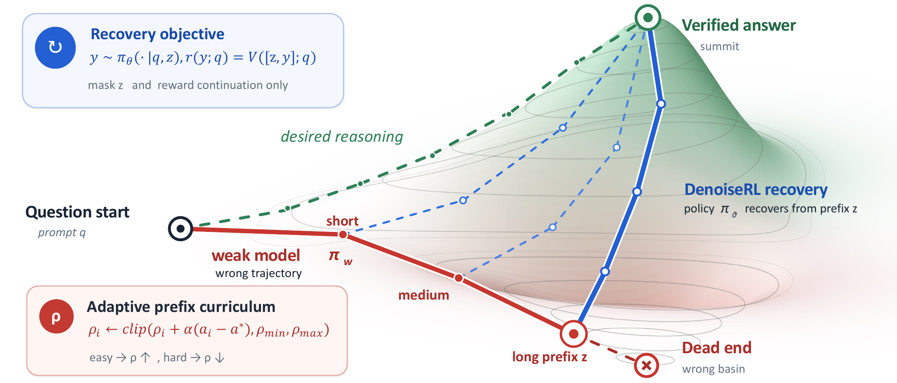

# DenoiseRL: Bootstrapping Reasoning Models to Recover from Noisy Prefixes

<p align="center">
  <a href="https://github.com/ALEX-nlp/DenoiseRL-agent">
    
  </a>
</p>



*DenoiseRL turns weak-model failures into structured reasoning noise. The policy learns to recover from a truncated wrong trajectory, while a sample-level curriculum adapts the prefix length to the policy's evolving capability.*

This repository contains the official mathematical-reasoning implementation of **DenoiseRL v2**. Instead of treating a weak model as an imperfect teacher, DenoiseRL uses its failed trajectories as recoverable perturbations. The policy is trained only on its continuation from the noisy prefix and receives a rule-based reward for reaching the verified answer.

The interactive-agent implementation is maintained separately in **[ALEX-nlp/DenoiseRL-agent](https://github.com/ALEX-nlp/DenoiseRL-agent)**. It applies the same recovery objective to noisy action prefixes in ALFWorld.

## What changed in v2

DenoiseRL v2 replaces the fixed-noise v1 recipe with a fine-grained adaptive curriculum:

- **Recovery-only rollout groups.** Each active problem uses `K = 16` noisy-prefix continuations and no additional clean rollout slots.
- **Per-problem noise control.** Every problem owns an independent prefix ratio `rho`, updated from its online recovery accuracy.
- **Line-aligned prefixes.** Requested prefix lengths are rounded to the nearest complete reasoning line when possible, preserving coherent intermediate states.
- **Continuation-only optimization.** Weak-model prefix tokens are verifier-visible but masked from the RL loss.
- **Curriculum refresh.** Problems whose recent `rho` trend has stabilized are retired and replaced; new problems inherit the active batch's post-update mean ratio.

The v1 fixed-ratio implementation remains in [`recipe/denoise`](./recipe/denoise), while the primary implementation used by the current paper is [`recipe/denoise_v2`](./recipe/denoise_v2). See [`recipe/README.md`](./recipe/README.md) for the version map and control recipes.

## Method

For each training problem `q`, a frozen weak model produces an incorrect trajectory `w`. DenoiseRL truncates `w` into a noisy prefix `z` and samples a continuation from the policy:

```text
y ~ pi_theta(. | q, z),     reward = V([z, y]; q)
```

The prefix tokens in `z` receive a zero loss mask; gradients flow only through the policy-generated continuation `y`.

At step `s`, problem `i` has a prefix ratio `rho_i` and recovery accuracy `a_i` measured over its `K` rollouts. The controller updates:

```text
rho_i <- clip(rho_i + alpha * (a_i - a_target), rho_min, rho_max)
```

Easy problems therefore receive longer wrong prefixes, while difficult problems receive shorter ones. With line-aligned truncation and stable-sample replacement, the curriculum keeps recovery difficulty close to the model's evolving capability boundary.

## Results

Mathematical results use Qwen2.5-1.5B-Instruct to collect weak-model failures and train Qwen3 base models on MATH-7.5K. AMC23, AIME24, and AIME25 use AVG@16; MATH500 and BBEH use AVG@1.

### Qwen3-4B-Base

| Method | MATH500 | AMC23 | AIME24 | AIME25 | BBEH | Avg. |
| --- | ---: | ---: | ---: | ---: | ---: | ---: |
| Base | 70.0 | 43.1 | 8.3 | 7.7 | 4.1 | 26.6 |
| GRPO | 83.6 | 63.1 | 22.1 | 18.1 | 11.1 | 39.6 |
| DAPO | 83.8 | 62.5 | 20.6 | 21.5 | 10.4 | 39.8 |
| Critique-GRPO (with ground truth) | **86.2** | 61.6 | 22.5 | 21.3 | 11.1 | 40.5 |
| GRPO + correct prefix | 80.2 | 58.9 | 18.5 | 12.3 | 13.3 | 36.6 |
| **DenoiseRL-GRPO** | 85.6 | **68.4** | **24.8** | 21.7 | 10.7 | 42.2 |
| **DenoiseRL-DAPO** | 83.6 | 67.2 | 23.3 | **22.9** | **14.3** | **42.3** |

### Qwen3-8B-Base

| Method | MATH500 | AMC23 | AIME24 | AIME25 | BBEH | Avg. |
| --- | ---: | ---: | ---: | ---: | ---: | ---: |
| Base | 70.4 | 49.2 | 11.9 | 10.8 | 4.1 | 29.3 |
| GRPO | 87.8 | 69.7 | 24.0 | 22.9 | 10.6 | 43.0 |
| DAPO | 87.0 | 69.7 | 23.8 | 21.7 | 11.7 | 42.8 |
| Critique-GRPO (with ground truth) | 86.6 | 68.8 | 26.0 | 22.1 | 13.5 | 43.4 |
| GRPO + correct prefix | 85.6 | 63.6 | 19.8 | 16.3 | 12.8 | 39.6 |
| **DenoiseRL-GRPO** | **88.0** | 71.4 | 26.3 | **23.8** | **15.4** | 44.9 |
| **DenoiseRL-DAPO** | 87.8 | **73.1** | **28.8** | 23.3 | 13.0 | **45.2** |

Additional findings:

- Fine-grained per-problem control gives a **15.6-point** average gain over Qwen3-4B-Base, compared with 13.9 for coarse-grained control and 13.5 for a fixed `rho = 0.2`.
- External weak-model prefixes provide the strongest late-stage noise intensity and the best overall accuracy compared with pre-RL self prefixes and random-token noise.
- The correct-prefix control underperforms ordinary GRPO at both model scales, showing that recovery from structured errors is not equivalent to conditioning on positive hints.
- Prefix construction is offline. On Qwen3-4B-Base, DenoiseRL-GRPO averages 67.0 seconds per step versus 48.8 seconds for GRPO; the difference mainly follows the longer generated continuations.

### Agentic decision-making

The [DenoiseRL-agent](https://github.com/ALEX-nlp/DenoiseRL-agent) implementation adapts line-level reasoning prefixes to step-level action prefixes in ALFWorld. With Qwen2.5-7B-Instruct as the policy and Qwen2.5-1.5B-Instruct as the weak model:

| Method | ALFWorld seen | ALFWorld unseen |
| --- | ---: | ---: |
| Base model | 13.6 | 12.7 |
| GRPO | 80.7 | 79.9 |
| **DenoiseRL-GRPO** | **96.3** | **88.1** |

## Repository layout

```text
DenoiseRL/
├── assets/                         # tracked README assets
├── data/                           # local datasets (ignored)
├── recipe/
│   ├── README.md                   # recipe/version guide
│   ├── denoise/                    # v1: legacy fixed-noise implementation
│   ├── denoise_v2/                 # v2: primary adaptive curriculum
│   └── correct_prefix/             # positive-prefix control
├── verl/                           # customized veRL runtime
└── requirements.txt
```

Local paper sources, generated outputs, scratch files, tests, and review-only artifacts are intentionally excluded from version control.

## Installation

Create an isolated environment, install the pinned dependencies, and run commands from the repository root so the bundled `verl` package is imported:

```bash
python -m venv .venv
source .venv/bin/activate
pip install -r requirements.txt
```

Hardware-sensitive packages such as `flash-attn`, `vllm`, CUDA/CuPy, or NPU components may need to be installed against the driver stack of the target cluster.

## Prepare noisy-prefix data

`recipe/denoise_v2/data_prepare.py` samples the weak model offline, verifies final boxed answers, and adds a `wrong_answer_with_boxed` pool to the source parquet:

```bash
python recipe/denoise_v2/data_prepare.py \
  --model /path/to/Qwen2.5-1.5B-Instruct \
  --dataset /path/to/MATH7500-train.parquet \
  --rollout-n 8 \
  --output-dir ./data
```

Set `TRAIN_FILE` in the launch command to the generated `*.with_wrong_boxed.parquet`.

## Train DenoiseRL v2

The standard GRPO launchers reproduce the recovery-only, per-problem adaptive curriculum:

```bash
# Qwen3-4B-Base
bash recipe/denoise_v2/grpo_denoise_qwen3-4b_v2.0-line.sh

# Qwen3-8B-Base
bash recipe/denoise_v2/grpo_denoise_qwen3-8b_v2.0-line.sh
```

DAPO-style dynamic sampling:

```bash
bash recipe/denoise_v2/grpo_denoise_dynamic_sample_line_qwen3-4b_v2.0.sh
bash recipe/denoise_v2/grpo_denoise_dynamic_sample_line_qwen3-8b_v2.0.sh
```

Important defaults:

| Setting | Default | Meaning |
| --- | ---: | --- |
| `sub_rollout_k` | `16` | recovery rollouts per active problem |
| `v2_initial_rho` / `v2_min_rho` | `0.0` | initial and minimum prefix ratio |
| `v2_max_rho` | `0.5` | maximum weak-trajectory fraction |
| `v2_target_accuracy` | `0.75` | target recovery accuracy |
| `v2_alpha` | `0.2` | per-step controller update size |
| `v2_history_window` | `5` | recent `rho` values used for stability |
| `v2_slope_threshold` | `0.02` | absolute slope threshold for replacement |
| `partial_wrong_cut_strategy` | `line` | align prefixes to complete lines |
| `partial_mode` | `none` | keep the prefix visible and mask it from loss |

Model paths, dataset paths, GPU count, tensor parallelism, response length, and experiment names can be overridden through the environment variables declared at the top of each launcher.

## Controls and variants

- [`recipe/correct_prefix`](./recipe/correct_prefix) implements the positive-prefix control. Its controller reverses the update direction so easy problems receive less correct assistance.
- `grpo_denoise_qwen3-4b_v2.0-line-self.sh` uses prefixes from the frozen pre-RL policy.
- `grpo_denoise_random_tokens_qwen3-{4b,8b}_v2.0.sh` replaces structured weak-model errors with random-token noise.

For the current method, start with the v2 line-aligned launchers rather than the legacy v1 scripts.
